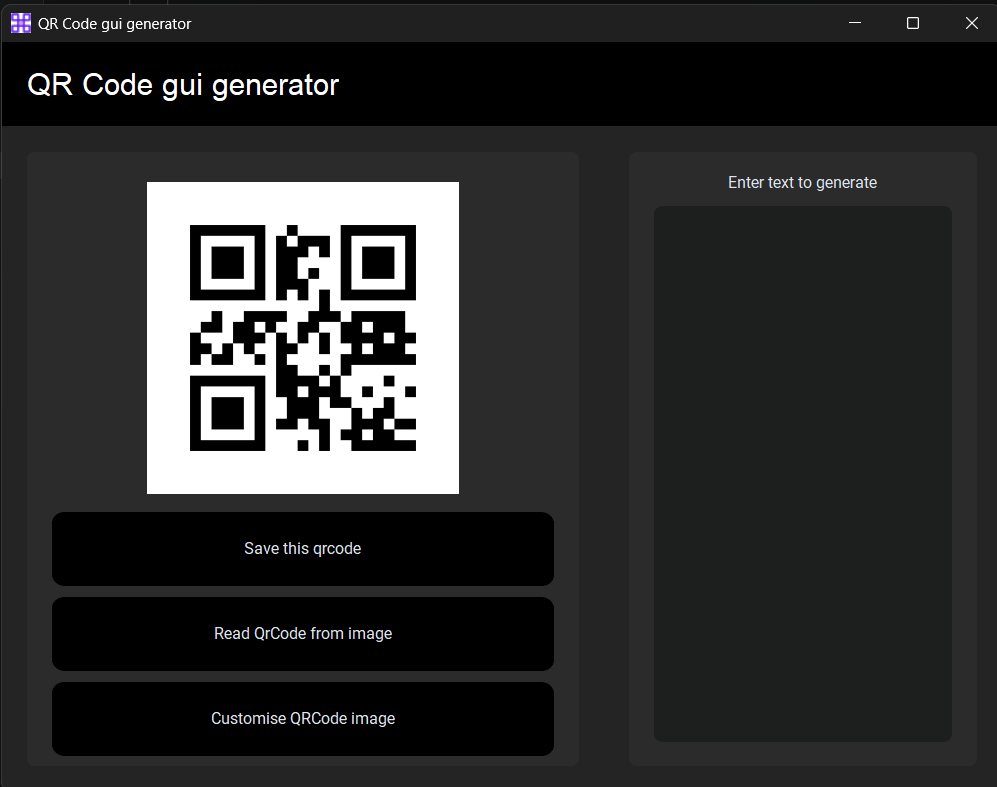

# QRCode-GUI-Generator
A Modern, Sleek, Minimal Quick Response Code generator with GUI for simplicity. This is entirely made by python, The Simple, Adaptive UI is make generate task complete

# Screenshot


# Installion
For linux (deb based)
```bash
sudo apt install git -y
git clone https://github.com/ganeshnair298-collab/QRCode-GUI-Generator.git
cd QRCode-GUI-Generator
pip install -r requirement.txt
python3 qrcode_gui.py
```
For Windows (Powershell)
```bash
winget install --id Git.Git -e --source winget
git --version
git clone https://github.com/ganeshnair298-collab/QRCode-GUI-Generator.git
cd QRCode-GUI-Generator
py -m pip install -r requirement.txt
python3 qrcode_gui.py
```
For making executive for your OS (Not needing Python)
+ Windows (Powershell)
```bash
cd QRCode-GUI-Generator
py -m pip install pyinstaller
pyinstaller --noconfirm --windowed --noconsole --add-data="assets;assets" --icon="assets/favicon.ico" --name="Name as you want" --clean qrcode_gui.py
cd dist
dir
```
+ Linux executive (more native and faster)
```bash
cd QRCode-GUI-Generator
pip3 install cython
# or
sudo apt intall binutils gcc python3-dev -y
cp -r qrcode_gui.py qrcode_gui.pyx
cython --embed -3 qrcode_gui.pyx -o qrcode_gui.c
gcc qrcode_gui.c -o qrcode_gui $(python3-config --embed --cflags --ldflags)
./qrcode_gui
```

# Reference
This project was created for testing and developing purpose only. It help me for understanding logic and gui understanding.

# Feautures
+ Generate QRCode at real time
+ Saving QRCode
+ Customise QRcode
+ Add image at center of QRCode
+ Read QRCode and display content
+ Modern, Simple UI for simplicity

# Third-Party Library Used
+ CustomTkinter (Modern UI)
+ Pyzbar for reading QRCode

# Caution
Use Python Version 3.12 or below because of library compability issue
